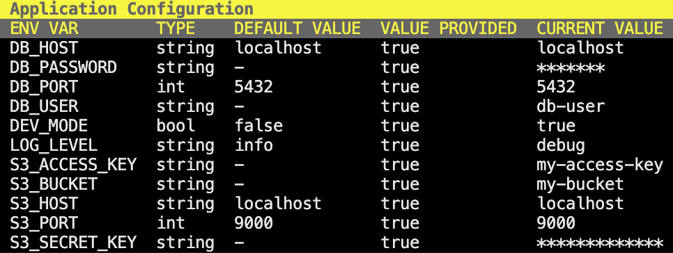

# go-config

Simple application configuration library for Go

## Installation

```bash
go get github.com/mxcd/go-config
```

## Usage

```go
package main

import (
	"github.com/mxcd/go-config/config"
)

func main() {
	err := config.LoadConfig([]config.Value{
		config.String("LOG_LEVEL").NotEmpty().Default("info"),
		config.Bool("DEV_MODE").Default(false),

		config.String("DB_HOST").NotEmpty().Default("localhost"),
		config.Int("DB_PORT").Default(5432),
		config.String("DB_USER").NotEmpty(),
		config.String("DB_PASSWORD").NotEmpty().Sensitive(),

		config.String("S3_HOST").NotEmpty().Default("localhost"),
		config.Int("S3_PORT").Default(9000),
		config.String("S3_ACCESS_KEY").NotEmpty(),
		config.String("S3_SECRET_KEY").NotEmpty().Sensitive(),
		config.String("S3_BUCKET").NotEmpty(),
	})

	if err != nil {
		panic(err)
	}
	config.Print()
}
```

The configuration struct will ensure, that required configuration values are present and that bool and int values are valid.  
Sensitive values will be masked when printed:



Values can be accessed via the `config.Get()` function.

```go
import (
	"github.com/mxcd/go-config/config"
)

func someFunction() {
  // ...
  devMode := config.Get().Bool("DEV_MODE")
	// ...
	logLevel := config.Get().String("LOG_LEVEL")
	// ...
	dbPort := config.Get().Int("DB_PORT")
  // ...
}
```
